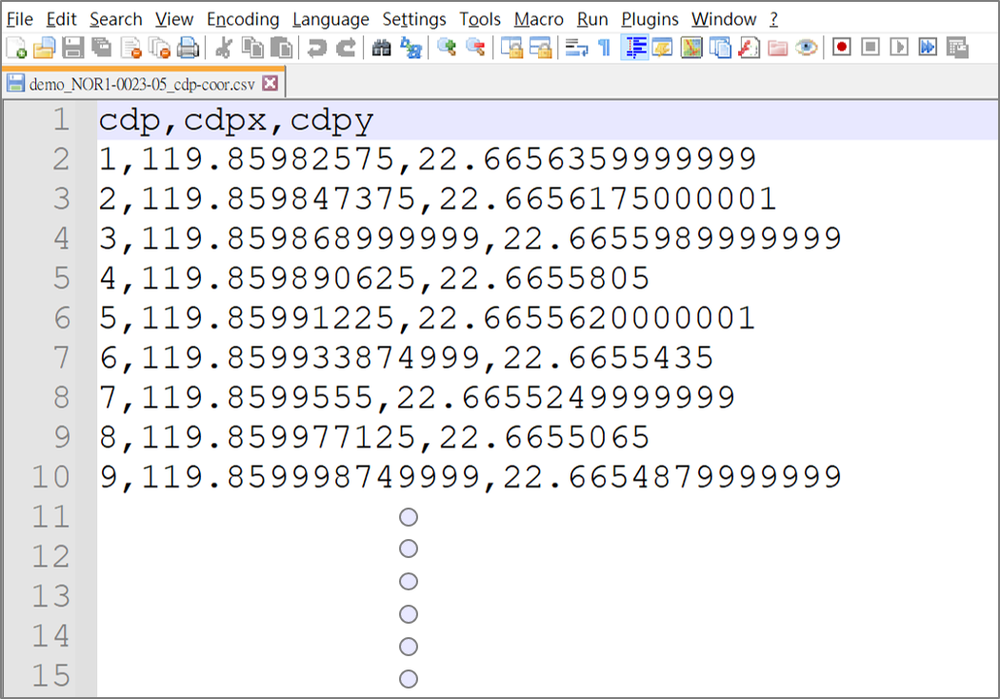
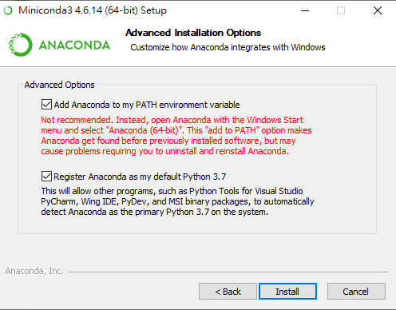
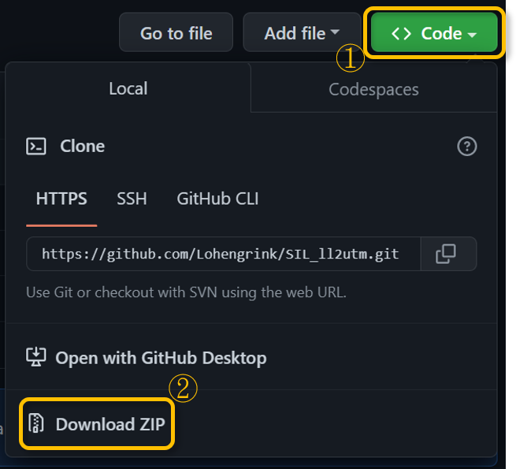
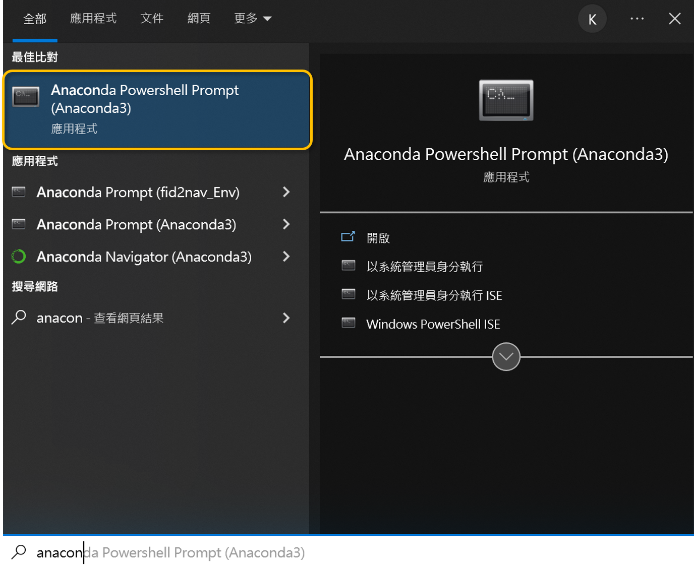
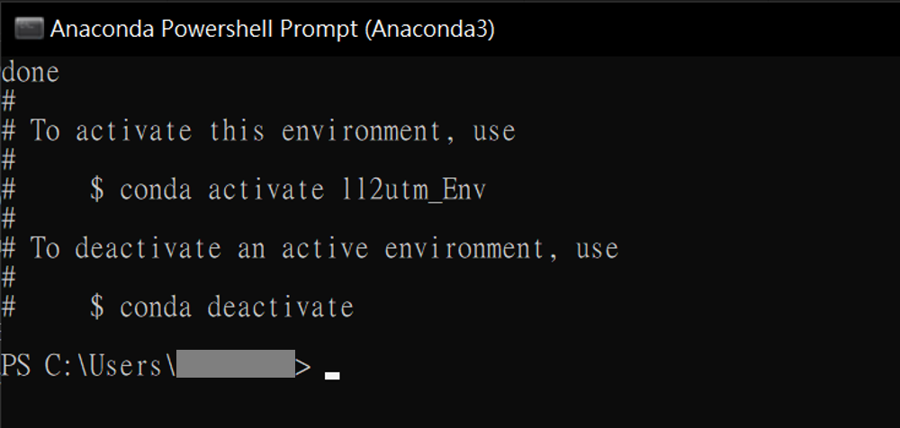
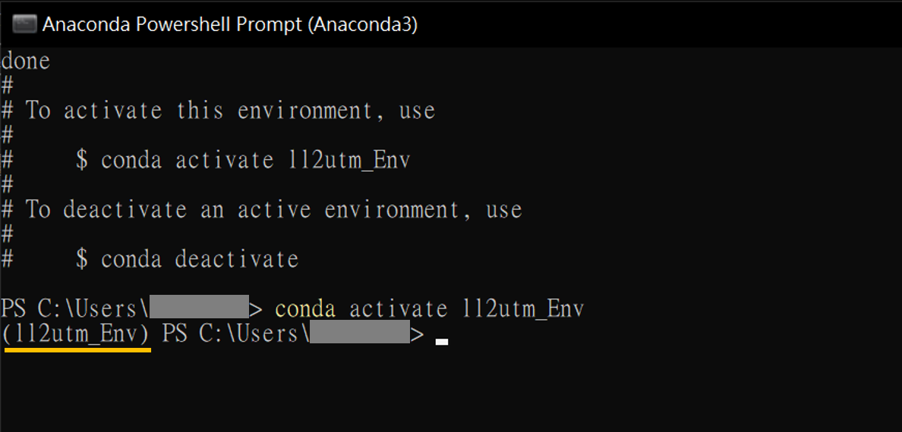
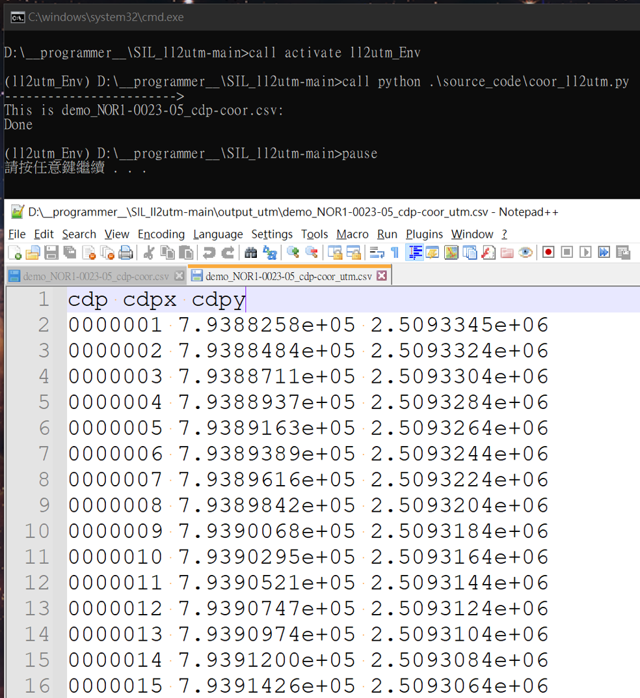

# ll2utm

哈囉您好
ll2utm是一個由python寫成的小工具。其主要的功能為將經緯度表示的座標轉換成utm50N的形式。

註：ll表示經度(Lon)和緯度(Lat)

## 如何操作ll2utm呢？

1. input_ll資料夾：請將欲轉換的經緯度檔案放到這個資料夾之中。

    共有三個欄位：第一欄位是CDP編號，第二欄位是CDP經度，第三欄位是CDP緯度，每個欄位之間以逗號分隔開來。文字檔的副檔名請用.csv或.txt。(如下圖)
    

2. output_utm資料夾：此資料夾用於存放轉換成utm表示的結果。此資料夾會於程式第一次執行的時候自動產生，也可以自己建立。

3. 雙擊run.bat即可執行此小程式。

## 如何安裝ll2utm呢？

關於安裝的方法其實非常多，這邊提供一套方法供大家參考。

首先，看看有沒有裝python，如果有，那麼只需要確認需要的套件是否都安裝好了。有python，有套件之後，應該即可執行。

如果沒有的話，建議安裝[Anaconda](https://www.anaconda.com/products/distribution)。

1. 安裝anaconda
除了在點選環境變數的地方，建議勾選起來，其他部分原則上一路next應該即可安裝完成。(如圖)
    

2. 在這個網址 <https://github.com/Lohengrink/SIL_ll2utm> 下載程式碼(如圖)

    

3. 之後在自己電腦中的"開始"，查詢Anaconda powershell (如圖)，雙擊打開
    

    在powerShell中

    - 3.1 在powerShell中，輸入pwd，來看目前所在的目錄位置

        ```bash
        pwd
        ```

    - 3.2 再將檔案ll2utm_Env.yml複製到上一步驟出現的目錄底下(ll2utm_Env.yml在下載後的資料夾之中。)

    - 3.3 接下來在powershell當中執行以下的程式碼：

        ```powershell bash conda
        conda env create --file ll2utm_Env.yml --name ll2utm_Env
        ```

        出現下圖表示執行成功(如圖)
    

    - 3.4 接著請執行下面指令：

        ```anaconda powershell
        conda activate ll2utm_Env
        ```

        當前方出現ll2utm_Env字樣(橘線)，表示環境已經切換成功。可以關閉power shell。(如圖)
    

4. 執行之前，請先將run貓的檔名改成run蝙蝠。(僅第一次需要做)

至此安裝大致完成。可點兩下run.bat即可執行。如出現以下畫面，表示執行成功。(如圖)

