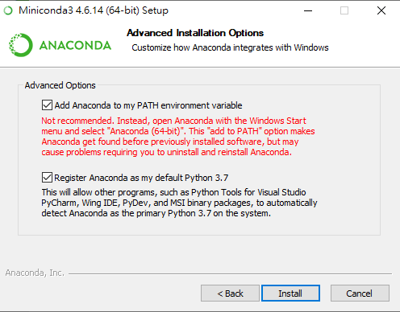
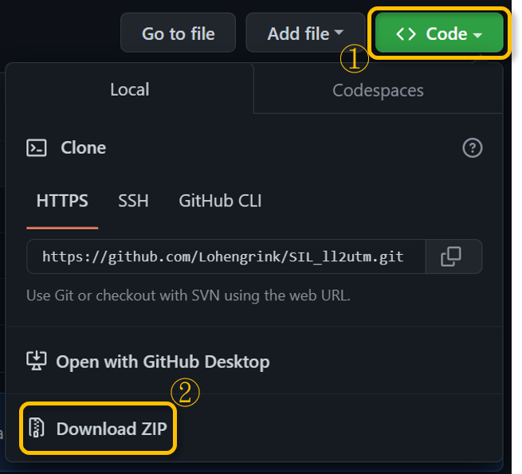
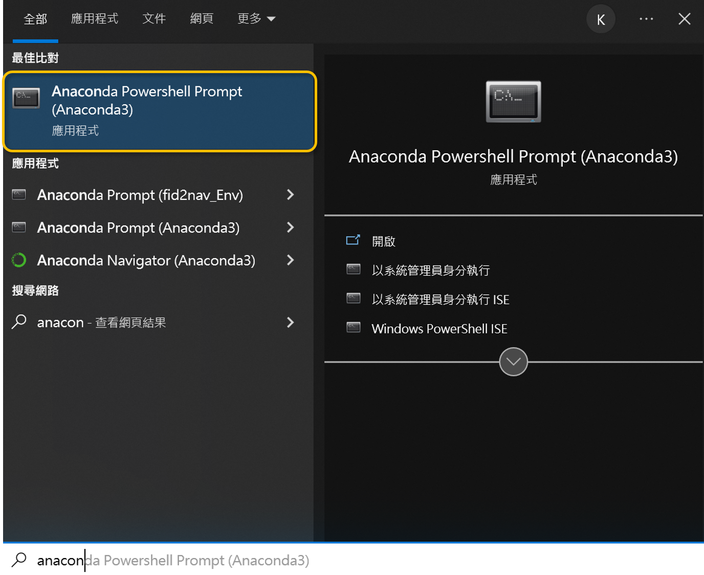
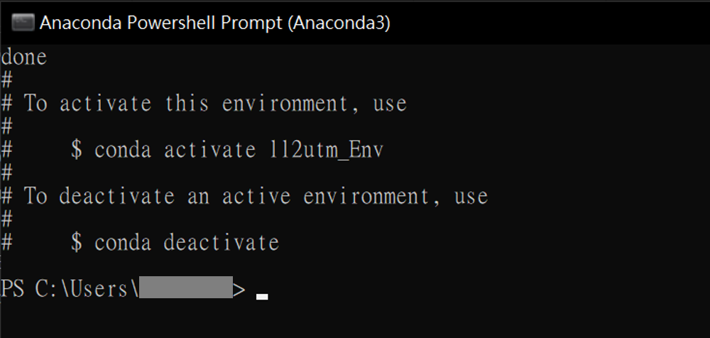
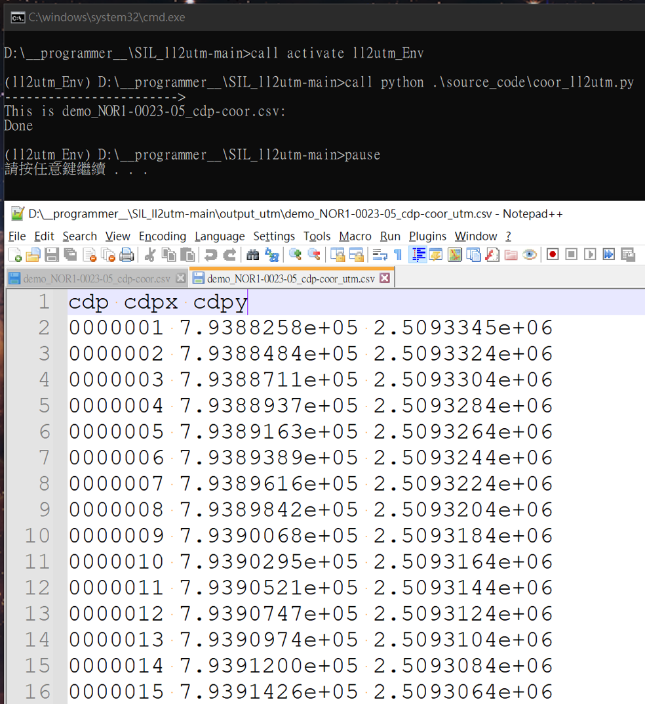

# ll2utm

Hi there,

ll2utm is a small tool written in python. Its main function is to convert the coordinates represented by latitude and longitude into the form of utm50N.

Note: 'll' means longitude (Lon) and latitude (Lat).

## How to operate ll2utm?

1. input_ll folder: Please put the latitude and longitude files to be converted into this folder.

     There are three fields: the first field is the CDP number, the second field is the CDP longitude, and the third field is the CDP latitude. Each field is separated by a comma. Please use .csv or .txt as the extension of the text file. (as shown in the figure)
     

2. output_utm folder: This folder is used to store the results converted into utm. This folder will be automatically generated when the program is executed for the first time, or you can create it yourself.

3. Double-click run.bat to execute this applet.

## How to install ll2utm?

There are actually many ways to install, here is a set of methods for your reference.

First, check to see if python is installed. If so, you only need to confirm that all required packages are installed. Once you have python and the package, you should be able to execute it.

If not, it is recommended to install [Anaconda](https://www.anaconda.com/products/distribution).

1. Install anaconda
In addition to clicking on the environment variable, it is recommended to check it. In principle, the other parts should be installed all the way next. (as shown in the figure)

    

2. Download the code from this website [ll2utm](https://github.com/Lohengrink/SIL_ll2utm)

     https://github.com/Lohengrink/SIL_ll2utm (as shown in the picture)

    

3. Open "Start" in your Windows computer. And query Anaconda powershell (as shown in the figure), double-click to open Powershell
    


     - 3.1 In powerShell, enter pwd to see the current directory location

         ```bash
         pwd
         ```

     - 3.2 Then copy the file, ll2utm_Env.yml to the directory that appeared in the previous step (At the beginning, ll2utm_Env.yml is in the downloaded folder.)

     - 3.3 Next, execute the following code in powershell:

         ```powershell bash conda
         conda env create --file ll2utm_Env.yml --name ll2utm_Env
         ```

        When the following figure appears, it indicates that the execution is successful (as shown in the figure)
    

     - 3.4 Then please execute the following command:

         ```anaconda powershell
         conda activate ll2utm_Env
         ```

         When the word ll2utm_Env (orange line) appears in front of it, it means that the environment has been switched successfully. Powershell can be closed. (as shown in the figure)


4. Before executing, please change the file name from run.cat to run.bat. (Only need to do it for the first time)

## Run
At this point, the installation is roughly complete. You can execute it by clicking run.bat twice. If the following screen appears, it means the execution is successful. (as shown in the figure)
